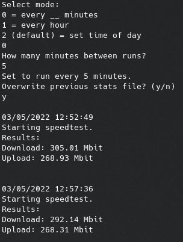
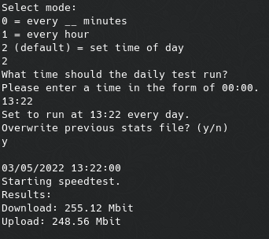

# speedtest-scheduler

Scheduler for speedtest-cli

## Table of Contents

- [About](#about)
- [Getting Started](#getting-started)
  - [Prerequisites](#prerequisites)
  - [Installing](#installing)
- [How It Works](#how-it-works)

## About

Uses `speedtest-cli` to test upload/download speed at set intervals.
Records the data in a csv file.

A good way to see if your ISP is throttling your connection.

## Getting Started

### Prerequisites

- Unix-based operating system
- speedtest-cli
- Python 3.6+
- Python dependencies:
  - schedule

### Installing

1) Clone the github repository: `git clone https://github.com/cw417/speedtest-scheduler`

2) Install `speedtest-cli`:

    - Ubuntu/Debian/PiOS/Rasbian: `sudo apt install speedtest-cli`

    - Arch/Manjaro: `sudo pacman -S speedtest-cli`

    - MacOS:

      ```zsh
      brew tap teamookla/speedtest
      brew update
      brew install speedtest --force
      ```

3) Install python dependencies: `pip3 install schedule`

4) Run speedtest-scheduler: `python3 app.py`

### Usage

- Select a mode when prompted:
  - `0` - runs the speedtest at a set interval of minutes specified by the user
    - the user will be prompted to enter an integer time in minutes for the interval
  - `1` - runs the speedtest once an hour from the time the test starts
  - `2` - runs the speedtest once daily at a time specified by the user
    - the user will be prompted to enter an hour in the form of `00:00`

#### Examples

 
  
## How It Works

- Uses the `speedtest-cli` application to test upload and download speed
  - `speedtest-cli` is a command line version of [speedtest.net](https://www.speedtest.net/apps/cli)
- The interval is set by the user
- Data is written to `stats.csv`
